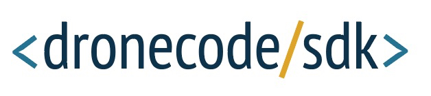

# Dronecode SDK

&nbsp; 

The *Dronecode SDK* is a [MAVLink](https://mavlink.io/en/) Library for the [PX4 flight stack](http://px4.io), with APIs for [C++](cpp/README.md) and [iOS](http://dronecode-sdk-swift.s3.eu-central-1.amazonaws.com/docs/master/index.html) (Python and Android are coming soon).

> **Tip** The SDK is the best way to integrate with PX4 over MAVLink! 
  It is supported by [Dronecode](https://www.dronecode.org/), ensuring that it is robust, well tested, and maintained. 

The library provides a simple API for managing one or more vehicles, providing programmatic access to vehicle information and telemetry, and control over missions, movement and other operations.

The library can run on a vehicle-based companion computer or on a ground-based GCS or mobile device (these devices have significantly more processing power that an ordinary flight controller, enabling tasks like computer vision, obstacle avoidance, and route planning).

Developers can extend the core C++ SDK using plugins in order to add any other required MAVLink API (for example, to integrate PX4 with custom cameras, gimbals, or other hardware over MAVLink).

Cross-platform wrappers for the core library are actively being developed.
These (primarily) use [gRPC](https://grpc.io/) and [Reactive Extensions](http://reactivex.io/).

## Project Status

The Dronecode SDK is in beta development. 
- The core C++ API has been created and is (largely) stable.
- iOS development is supported using the [Dronecode-SDK-Swift](http://dronecode-sdk-swift.s3.eu-central-1.amazonaws.com/docs/master/index.html) library.
- Other cross-platform wrappers are actively being developed, and should be released soon.

## Getting Started

* iOS developers should read the [Dronecode-SDK-Swift](http://dronecode-sdk-swift.s3.eu-central-1.amazonaws.com/docs/master/index.html) reference.

  > **Tip** The Dronecode-SDK-Swift is in alpha development. 
    We plan to make our first official (beta) release in the coming weeks.

* C++ Developers should start at the [C++ Library](cpp/README.md).

* Developers who want to contribute to the API will need to build the C++ library (and other programming language wrappers) from source. For more information see the [contributing section](#contributing) below.
 

## Getting Help

This guide contains information and examples showing how to use the SDK. 
If you have specific questions that are not answered by the documentation, these can be raised on:

* [Discuss board](http://discuss.px4.io/c/sdk)
* [Slack (#sdk)](https://px4.slack.com/messages/C68J8H32A) (get a [Slack login here](http://slack.px4.io))

Use Github for bug reports/enhancement requests:

* [C++ API](https://github.com/Dronecode/DronecodeSDK/issues)
* [C++ Documentation](https://github.com/dronecore/sdk_docs/issues)
* [Swift API and Docs](https://github.com/Dronecode/DronecodeSDK-Swift/issues)
<!-- Add info about where Python etc API issues are reported). -->

## Library Features

The core library is written in C++, with auto-generated bindings for other supported programming languages.

The library is:
- Straightforward and easy to use. It has an API that supports both synchronous (blocking) and asynchronous calls (using callbacks). 
- Fast, robust, and lightweight. Built to handle onboard usage with high rate messaging.
- Cross-platform (Linux, macOS, Windows, iOS, Android).
- Extensible, using compile-time plugins.

The main features provided by the core API are (in all programing languages):

* Connect to and manage up to 255 vehicles via a TCP, UDP or serial connection.
* Get information about vehicles (vendor, software versions, product versions etc.)
* Get vehicle telemetry and state information (e.g. battery, GPS, RC connection, flight mode etc.) and set telemetry update rates.
* Send commands to arm, disarm, kill, takeoff, land and return to launch.
* Create and manage missions.
* Control a camera and gimbal both inside and outside of missions.
* Send commands to directly control vehicle movement.
* Send commands to start sensor calibration.

See the [FAQ](getting_started/faq.md) for answers to common questions about the library. 

## Contributing

We welcome contributions! If you want to help or have suggestions/bug reports [please get in touch with the development team](#getting-help). 

The [Contributing](contributing/README.md) (C++) section contains everything you need to contribute, including topics about building the SDK from source code, running our integration and unit tests, and all other aspects of core development. 

## License

* The *Dronecode SDK* is licensed under the permissive [BSD 3-clause](https://github.com/Dronecode/DronecodeSDK/blob/{{ book.github_branch }}/LICENSE.md).
* This documentation is licensed under [CC BY 4.0](https://creativecommons.org/licenses/by/4.0/) license.

## Governance

The DronecodeSDK project is hosted under the governance of the [Dronecode Foundation](https://www.dronecode.org/).

&nbsp;

