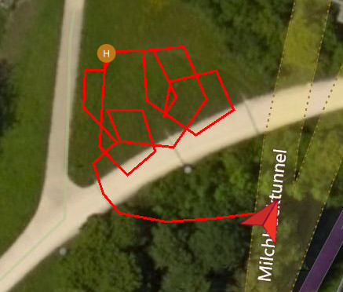

# Example: Follow Me Mode

This example demonstrates how to use the [Follow Me](../guide/follow_me.md) plugin. 
It shows how to send the drone both the current position of the target (`FollowMe::TargetLocation`) and the relative position at which it should follow (`FollowMe::Config`).



> **Note** A real application using this API will get the position information from the underlying operating system. The example uses a fake position source (`FakeLocationProvider`) to enable it to be run on computers that do not have position information. The `FakeLocationProvider` emulates the typical usage of common positioning APIs used in Android, Linux and iPhone.


## Running the Example {#run_example}

Special notes for this example: 

* Before running this example you will need to install Boost libraries. For Linux this is done as shown below:
  ```sh
  sudo apt-get install libboost-all-dev
  ```
* *QGroundControl* **should not be used** at the same time as this example. See [QGC #6141](https://github.com/mavlink/qgroundcontrol/issues/6141) for more information.

Otherwise the example is built and run in the normal way ([as described here](../examples/README.md#trying_the_examples)). 

The example terminal output should be similar to that shown below:

> **Note** This is from a debug build of DroneCore. A release build will omit the "Debug" messages.

```
$ ./follow_me 
Wait for system to connect via heartbeat
[11:40:49|Info ] New system on: 127.0.0.1:14557 (udp_connection.cpp:211)
[11:40:49|Debug] MAVLink: info: DISARMED by auto disarm on land (device.cpp:247)
[11:40:50|Debug] Discovered 4294967298 (dronecore_impl.cpp:219)
[11:40:50|Info ] FollowMe: Applying default FollowMe configuration FollowMe to the system... (follow_me_impl.cpp:186)
System is ready
Armed
[11:40:51|Debug] MAVLink: info: ARMED by arm/disarm component command (device.cpp:247)
[11:40:51|Debug] MAVLink: info: [logger] file: rootfs/fs/microsd/log/2018-02-14/0 (device.cpp:247)
In Air...
[11:40:51|Debug] MAVLink: info: Using minimum takeoff altitude: 2.50 m (device.cpp:247)
[11:40:51|Debug] MAVLink: info: Takeoff detected (device.cpp:247)
[11:40:51|Debug] MAVLink: critical: Using minimum takeoff altitude: 2.50 m (device.cpp:247)
[11:40:51|Debug] MAVLink: info: data link #1 lost (device.cpp:247)
[FlightMode: Takeoff] Vehicle is at: nan, nan degrees.
[FlightMode: Hold] Vehicle is at: nan, nan degrees.
[FlightMode: Hold] Vehicle is at: nan, nan degrees.
[FlightMode: Hold] Vehicle is at: nan, nan degrees.
[FlightMode: Hold] Vehicle is at: nan, nan degrees.
[11:40:56|Debug] FollowMe: Waiting for the device confirmation of the new configuration.. (follow_me_impl.cpp:98)
[11:40:56|Debug] FollowMe: Waiting for the device confirmation of the new configuration.. (follow_me_impl.cpp:98)
[11:40:56|Info ] FollowMe: Configured: Min height: 20 meters, Follow distance: 8 meters, Follow direction: Front right, Responsiveness: 0.5 (follow_me_impl.cpp:101)
[FlightMode: FollowMe] Vehicle is at: nan, nan degrees.
[FlightMode: FollowMe] Vehicle is at: 47.3977, 8.54559 degrees.
[FlightMode: FollowMe] Vehicle is at: 47.3977, 8.54559 degrees.
...
[FlightMode: FollowMe] Vehicle is at: 47.3976, 8.5457 degrees.
[FlightMode: FollowMe] Vehicle is at: 47.3976, 8.54573 degrees.
waiting until landed
[11:41:33|Debug] MAVLink: info: Landing at current position (device.cpp:247)
waiting until landed
waiting until landed
...
waiting until landed
waiting until landed
[11:42:04|Debug] MAVLink: info: Landing detected (device.cpp:247)
Landed...
```

## How it works

The example registers with `FakeLocationProvider` for location updates. 
These are passed to the Follow Me plugin, which in turn sends them to the vehicle. 

The operation of the "DroneCore" part of this code is discussed in the guide: [Follow Me](../guide/follow_me.md).


## Source code {#source_code}

> **Tip** The full source code for the example [can be found on Github here](https://github.com/dronecore/DroneCore/tree/{{ book.github_branch }}/example/fly_mission).


[CMakeLists.txt](https://github.com/dronecore/DroneCore/blob/{{ book.github_branch }}/example/follow_me/CMakeLists.txt)

```make
cmake_minimum_required(VERSION 2.8.12)

project(follow_me)

find_package(Boost 1.66 COMPONENTS REQUIRED system)
include_directories(${Boost_INCLUDE_DIR})

if(NOT MSVC)
    add_definitions("-std=c++11 -Wall -Wextra -Werror")
else()
    add_definitions("-std=c++11 -WX -W2")
    include_directories(${CMAKE_SOURCE_DIR}/../../install/include)
    link_directories(${CMAKE_SOURCE_DIR}/../../install/lib)
endif()

add_executable(follow_me
    follow_me.cpp
    fake_location_provider.cpp
)

target_link_libraries(follow_me
    LINK_PUBLIC ${Boost_LIBRARIES}
    dronecore
    dronecore_action
    dronecore_follow_me
)
```

[follow_me.cpp](https://github.com/dronecore/DroneCore/blob/{{ book.github_branch }}/example/follow_me/follow_me.cpp)

```cpp
/**
* @file follow_me.cpp
*
* @brief Example that demonstrates the usage of Follow Me plugin.
* The example registers with FakeLocationProvider for location updates
* and sends them to the Follow Me plugin which are sent to drone. You can observe
* drone following you. We print last location of the drone in flight mode callback.
*
* @author Shakthi Prashanth <shakthi.prashanth.m@intel.com>
* @date 2018-01-03
*/

#include <chrono>
#include <dronecore/action.h>
#include <dronecore/dronecore.h>
#include <dronecore/follow_me.h>
#include <dronecore/telemetry.h>
#include <iostream>
#include <memory>
#include <thread>

#include "fake_location_provider.h"

using namespace dronecore;
using namespace std::placeholders; // for `_1`
using namespace std::chrono; // for seconds(), milliseconds(), etc
using namespace std::this_thread;  // for sleep_for()

// For coloring output
#define ERROR_CONSOLE_TEXT "\033[31m" //Turn text on console red
#define TELEMETRY_CONSOLE_TEXT "\033[34m" //Turn text on console blue
#define NORMAL_CONSOLE_TEXT "\033[0m"  //Restore normal console colour

inline void action_error_exit(ActionResult result, const std::string &message);
inline void follow_me_error_exit(FollowMe::Result result, const std::string &message);
inline void connection_error_exit(ConnectionResult result, const std::string &message);

int main(int, char **)
{
    DroneCore dc;

    ConnectionResult conn_result = dc.add_udp_connection();
    connection_error_exit(conn_result, "Connection failed");

    // Wait for the system to connect via heartbeat
    while (!dc.is_connected()) {
        std::cout << "Wait for system to connect via heartbeat" << std::endl;
        sleep_for(seconds(1));
    }

    // System got discovered.
    System &system = dc.system();
    auto action = std::make_shared<Action>(system);
    auto follow_me = std::make_shared<FollowMe>(system);
    auto telemetry = std::make_shared<Telemetry>(system);

    while (!telemetry->health_all_ok()) {
        std::cout << "Waiting for system to be ready" << std::endl;
        sleep_for(seconds(1));
    }
    std::cout << "System is ready" << std::endl;

    // Arm
    ActionResult arm_result = action->arm();
    action_error_exit(arm_result, "Arming failed");
    std::cout << "Armed" << std::endl;

    // Subscribe to receive updates on flight mode. You can find out whether FollowMe is active.
    telemetry->flight_mode_async(
    std::bind([&](Telemetry::FlightMode flight_mode) {
        const FollowMe::TargetLocation last_location = follow_me->get_last_location();
        std::cout << "[FlightMode: " << Telemetry::flight_mode_str(flight_mode)
                  << "] Vehicle is at: " << last_location.latitude_deg << ", "
                  << last_location.longitude_deg << " degrees." << std::endl;
    }, std::placeholders::_1));

    // Takeoff
    ActionResult takeoff_result = action->takeoff();
    action_error_exit(takeoff_result, "Takeoff failed");
    std::cout << "In Air..." << std::endl;
    sleep_for(seconds(5)); // Wait for drone to reach takeoff altitude

    // Configure Min height of the drone to be "20 meters" above home & Follow direction as "Front right".
    FollowMe::Config config;
    config.min_height_m = 20.0;
    config.follow_direction = FollowMe::Config::FollowDirection::FRONT_RIGHT;
    FollowMe::Result follow_me_result = follow_me->set_config(config);

    // Start Follow Me
    follow_me_result = follow_me->start();
    follow_me_error_exit(follow_me_result, "Failed to start FollowMe mode");

    boost::asio::io_service io; // for event loop
    std::unique_ptr<FakeLocationProvider> location_provider(new FakeLocationProvider(io));
    // Register for platform-specific Location provider. We're using FakeLocationProvider for the example.
    location_provider->request_location_updates([&system, &follow_me](double lat, double lon) {
        follow_me->set_target_location({lat, lon, 0.0, 0.f, 0.f, 0.f});
    });
    io.run(); // will run as long as location updates continue to happen.

    // Stop Follow Me
    follow_me_result = follow_me->stop();
    follow_me_error_exit(follow_me_result, "Failed to stop FollowMe mode");

    // Stop flight mode updates.
    telemetry->flight_mode_async(nullptr);

    // Land
    const ActionResult land_result = action->land();
    action_error_exit(land_result, "Landing failed");
    while (telemetry->in_air()) {
        std::cout << "waiting until landed" << std::endl;
        sleep_for(seconds(1));
    }
    std::cout << "Landed..." << std::endl;
    return 0;
}

// Handles Action's result
inline void action_error_exit(ActionResult result, const std::string &message)
{
    if (result != ActionResult::SUCCESS) {
        std::cerr << ERROR_CONSOLE_TEXT << message << action_result_str(
                      result) << NORMAL_CONSOLE_TEXT << std::endl;
        exit(EXIT_FAILURE);
    }
}
// Handles FollowMe's result
inline void follow_me_error_exit(FollowMe::Result result, const std::string &message)
{
    if (result != FollowMe::Result::SUCCESS) {
        std::cerr << ERROR_CONSOLE_TEXT << message << FollowMe::result_str(
                      result) << NORMAL_CONSOLE_TEXT << std::endl;
        exit(EXIT_FAILURE);
    }
}
// Handles connection result
inline void connection_error_exit(ConnectionResult result, const std::string &message)
{
    if (result != ConnectionResult::SUCCESS) {
        std::cerr << ERROR_CONSOLE_TEXT << message
                  << connection_result_str(result)
                  << NORMAL_CONSOLE_TEXT << std::endl;
        exit(EXIT_FAILURE);
    }
}
```

[fake_location_provider.h](https://github.com/dronecore/DroneCore/blob/{{ book.github_branch }}/example/follow_me/fake_location_provider.h)

```cpp
#pragma once

#include <functional>
/**
  ********************************************************************************************
  ********************************************************************************************
  Important note: Boost isn't a dependency for DroneCore library.
  We're using Boost::Asio in this example ONLY to simulate asynchronous Fake location provider.
  Applications on platforms Android, Windows, Apple, etc should make use of their platform-specific
  Location Provider in place of FakeLocationProvider.
  ********************************************************************************************
  ********************************************************************************************
  */
#include <boost/asio.hpp>
#include <boost/date_time/posix_time/posix_time.hpp>

/**
 * @brief The FakeLocationProvider class
 * This class provides periodic reports on the fake location of the device.
 */
class FakeLocationProvider
{
public:
    typedef std::function<void(double lat, double lon)> location_callback_t;

    FakeLocationProvider(boost::asio::io_service &io)
        : timer_(io, boost::posix_time::seconds(1))
    {}

    ~FakeLocationProvider()
    {}

    void request_location_updates(location_callback_t callback);

private:

    void compute_next_location();

    boost::asio::deadline_timer timer_;
    location_callback_t location_callback_ = nullptr;
    double latitude_deg_ = 47.3977419;
    double longitude_deg_ = 8.5455938;
    size_t count_ = 0u;

    static const size_t MAX_LOCATIONS;
    static const double LATITUDE_DEG_PER_METER;
    static const double LONGITUDE_DEG_PER_METER;
};
```

[fake_location_provider.cpp](https://github.com/dronecore/DroneCore/blob/{{ book.github_branch }}/example/follow_me/fake_location_provider.cpp)

```cpp

#include "fake_location_provider.h"

void FakeLocationProvider::request_location_updates(location_callback_t callback)
{
    location_callback_ = callback;
    timer_.async_wait(std::bind(&FakeLocationProvider::compute_next_location, this));
}

// Rudimentary location provider whose successive lat, lon combination
// makes Drone revolve in a semi-circular path.
void FakeLocationProvider::compute_next_location()
{
    if (count_++ < 10) {
        location_callback_(latitude_deg_, longitude_deg_);
        latitude_deg_ -= LATITUDE_DEG_PER_METER * 4;
        timer_.expires_at(timer_.expires_at() + boost::posix_time::seconds(1));
        timer_.async_wait(std::bind(&FakeLocationProvider::compute_next_location, this));
        sleep(1);
    }
    if (count_++ < 20) {
        location_callback_(latitude_deg_, longitude_deg_);
        longitude_deg_ += LONGITUDE_DEG_PER_METER * 4;
        timer_.expires_at(timer_.expires_at() + boost::posix_time::seconds(1));
        timer_.async_wait(std::bind(&FakeLocationProvider::compute_next_location, this));
        sleep(1);
    }
    if (count_++ < 30) {
        location_callback_(latitude_deg_, longitude_deg_);
        latitude_deg_ += LATITUDE_DEG_PER_METER * 4;
        timer_.expires_at(timer_.expires_at() + boost::posix_time::seconds(1));
        timer_.async_wait(std::bind(&FakeLocationProvider::compute_next_location, this));
        sleep(1);
    }
    if (count_++ < 40) {
        location_callback_(latitude_deg_, longitude_deg_);
        longitude_deg_ -= LONGITUDE_DEG_PER_METER * 4;
        timer_.expires_at(timer_.expires_at() + boost::posix_time::seconds(1));
        timer_.async_wait(std::bind(&FakeLocationProvider::compute_next_location, this));
        sleep(1);
    }
    if (count_++ < 50) {
        location_callback_(latitude_deg_, longitude_deg_);
        latitude_deg_ -= LATITUDE_DEG_PER_METER * 3;
        timer_.expires_at(timer_.expires_at() + boost::posix_time::seconds(1));
        timer_.async_wait(std::bind(&FakeLocationProvider::compute_next_location, this));
        sleep(1);
    }
    if (count_++ < MAX_LOCATIONS) {
        location_callback_(latitude_deg_, longitude_deg_);
        longitude_deg_ += LONGITUDE_DEG_PER_METER * 3;
        timer_.expires_at(timer_.expires_at() + boost::posix_time::seconds(1));
        timer_.async_wait(std::bind(&FakeLocationProvider::compute_next_location, this));
        sleep(1);
    }
}

const size_t FakeLocationProvider::MAX_LOCATIONS = 60u;
const double FakeLocationProvider::LATITUDE_DEG_PER_METER = 0.000009044;
const double FakeLocationProvider::LONGITUDE_DEG_PER_METER = 0.000008985;
```

