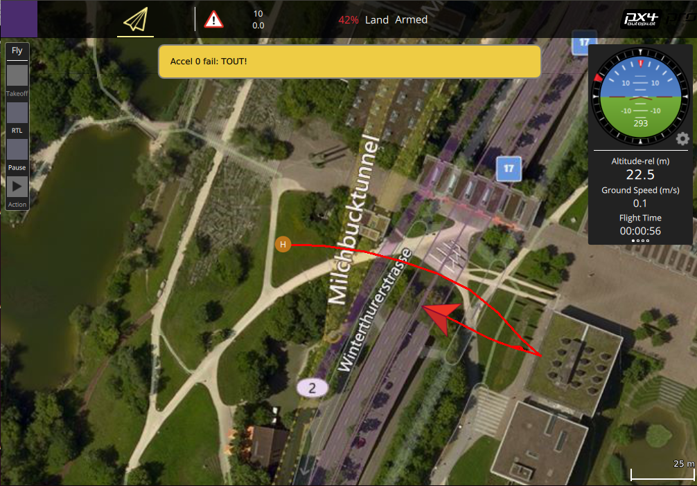

# Example: VTOL Transitions

This example shows how you can use DroneCore to transition between VTOL copter and fixed-wing modes (and back).




## Running the Example {#run_example}

The example must be run against a VTOL aircraft. Otherwise the example is built and run [in the standard way](../examples/README.md#trying_the_examples).

> **Tip** Instructions for running the Gazebo simulator for a standard VTOL can be found here: [PX4 Development Guide > Gazebo Simulation](https://dev.px4.io/en/simulation/gazebo.html#standard-vtol). jMAVSim does not support VTOL simulation.

The example terminal output for a debug build of DroneCore should be similar to that shown below (a release build will omit the "Debug" messages):

```
$ ./transition_vtol_fixed_wing 
Waiting to discover system...
[10:24:42|Info ] New system on: 127.0.0.1:14557 (udp_connection.cpp:210)
[10:24:42|Debug] MAVLink: info: [logger] file: rootfs/fs/microsd/log/2017-11-21/0 (device_impl.cpp:229)
[10:24:42|Debug] MAVLink: info: Landing detected (device_impl.cpp:229)
[10:24:43|Debug] Discovered 4294967298 (dronecore_impl.cpp:234)
Discovered system with UUID: 4294967298
Arming...
Taking off...
[10:24:44|Debug] MAVLink: info: ARMED by arm/disarm component command (device_impl.cpp:229)
[10:24:44|Debug] MAVLink: info: Using minimum takeoff altitude: 10.00 m (device_impl.cpp:229)
[10:24:44|Debug] MAVLink: info: Takeoff detected (device_impl.cpp:229)
[10:24:44|Debug] MAVLink: critical: Using minimum takeoff altitude: 10.00 m (device_impl.cpp:229)
Altitude: 0.079 m
Altitude: 0.507 m
...
Altitude: 10.254 m
Transition to fixedwing...
Altitude: 10.263 m
...
Altitude: 20.72 m
Altitude: 24.616 m
Altitude: 22.262 m
Transition back to multicopter...
Altitude: 17.083 m
...
Return to launch...
Altitude: 11.884 m
[10:25:09|Debug] MAVLink: info: RTL: climb to 518 m (29 m above home) (device_impl.cpp:229)
Altitude: 13.61 m
...
Altitude: 27.489 m
Altitude: 28.892 m
[10:25:18|Debug] MAVLink: info: RTL: return at 517 m (29 m above home) (device_impl.cpp:229)
Altitude: 29.326 m
Altitude: 29.33 m
...
Altitude: 29.323 m
Altitude: 29.357 m
Landing...
[10:25:29|Debug] MAVLink: info: Landing at current position (device_impl.cpp:229)
Altitude: 29.199 m
Altitude: 28.722 m
Altitude: 28.189 m
Altitude: 27.62 m
Finished...
```

## How it works

The operation of the transition code is discussed in the guide: [Takeoff and Landing (and other actions)](../guide/taking_off_landing.md#transition_vtol).

## Source code {#source_code}

> **Tip** The full source code for the example [can be found on Github here](https://github.com/dronecore/DroneCore/tree/{{ book.github_branch }}/example/transition_vtol_fixed_wing).


[CMakeLists.txt](https://github.com/dronecore/DroneCore/blob/{{ book.github_branch }}/example/transition_vtol_fixed_wing/CMakeLists.txt)

```make
cmake_minimum_required(VERSION 2.8.12)

project(transition_vtol_fixed_wing)

if(NOT MSVC)
    add_definitions("-std=c++11 -Wall -Wextra -Werror")
else()
    add_definitions("-std=c++11 -WX -W2")
    include_directories(${CMAKE_SOURCE_DIR}/../../install/include)
    link_directories(${CMAKE_SOURCE_DIR}/../../install/lib)
endif()

add_executable(transition_vtol_fixed_wing
    transition_vtol_fixed_wing.cpp
)

target_link_libraries(transition_vtol_fixed_wing
    dronecore
    dronecore_action
    dronecore_telemetry
)
```

[transition_vtol_fixed_wing.cpp](https://github.com/dronecore/DroneCore/blob/{{ book.github_branch }}/example/transition_vtol_fixed_wing/transition_vtol_fixed_wing.cpp)

```cpp
#include <chrono>
#include <cstdint>
#include <dronecore/action.h>
#include <dronecore/dronecore.h>
#include <dronecore/telemetry.h>
#include <iostream>
#include <thread>

using std::this_thread::sleep_for;
using std::chrono::milliseconds;
using namespace dronecore;

#define ERROR_CONSOLE_TEXT "\033[31m" //Turn text on console red
#define TELEMETRY_CONSOLE_TEXT "\033[34m" //Turn text on console blue
#define NORMAL_CONSOLE_TEXT "\033[0m"  //Restore normal console colour

int main(int /*argc*/, char ** /*argv*/)
{
    DroneCore dc;

    bool discovered_system = false;

    ConnectionResult connection_result = dc.add_udp_connection();

    if (connection_result != ConnectionResult::SUCCESS) {
        std::cout << ERROR_CONSOLE_TEXT << "Connection failed: "
                  << connection_result_str(connection_result)
                  << NORMAL_CONSOLE_TEXT << std::endl;
        return 1;
    }

    std::cout << "Waiting to discover system..." << std::endl;
    dc.register_on_discover([&discovered_system](uint64_t uuid) {
        std::cout << "Discovered system with UUID: " << uuid << std::endl;
        discovered_system = true;
    });

    // We usually receive heartbeats at 1Hz, therefore we should find a system after around 2 seconds.
    std::this_thread::sleep_for(std::chrono::seconds(2));

    if (!discovered_system) {
        std::cout << ERROR_CONSOLE_TEXT << "No system found, exiting." << NORMAL_CONSOLE_TEXT << std::endl;
        return 1;
    }

    // We don't need to specify the UUID if it's only one system anyway.
    // If there were multiple, we could specify it with:
    // dc.system(uint64_t uuid);
    System &system = dc.system();
    auto telemetry = std::make_shared<Telemetry>(system);

    // We want to listen to the altitude of the drone at 1 Hz.
    const Telemetry::Result set_rate_result = telemetry->set_rate_position(1.0);
    if (set_rate_result != Telemetry::Result::SUCCESS) {
        std::cout << ERROR_CONSOLE_TEXT << "Setting rate failed:" << Telemetry::result_str(
                      set_rate_result) << NORMAL_CONSOLE_TEXT << std::endl;
        return 1;
    }


    // Set up callback to monitor altitude while the vehicle is in flight
    telemetry->position_async([](Telemetry::Position position) {
        std::cout << TELEMETRY_CONSOLE_TEXT // set to blue
                  << "Altitude: " << position.relative_altitude_m << " m"
                  << NORMAL_CONSOLE_TEXT // set to default color again
                  << std::endl;
    });


    // Check if vehicle is ready to arm
    if (telemetry->health_all_ok() != true) {
        std::cout << ERROR_CONSOLE_TEXT << "Vehicle not ready to arm" << NORMAL_CONSOLE_TEXT << std::endl;
        return 1;
    }

    auto action = std::make_shared<Action>(system);

    // Arm vehicle
    std::cout << "Arming..." << std::endl;
    const ActionResult arm_result = action->arm();

    if (arm_result != ActionResult::SUCCESS) {
        std::cout << ERROR_CONSOLE_TEXT << "Arming failed:" << action_result_str(
                      arm_result) << NORMAL_CONSOLE_TEXT << std::endl;
        return 1;
    }

    // Take off
    std::cout << "Taking off..." << std::endl;
    const ActionResult takeoff_result = action->takeoff();
    if (takeoff_result != ActionResult::SUCCESS) {
        std::cout << ERROR_CONSOLE_TEXT << "Takeoff failed:" << action_result_str(
                      takeoff_result) << NORMAL_CONSOLE_TEXT << std::endl;
        return 1;
    }

    // Wait
    std::this_thread::sleep_for(std::chrono::seconds(10));

    std::cout << "Transition to fixedwing..." << std::endl;
    const ActionResult fw_result = action->transition_to_fixedwing();

    if (fw_result != ActionResult::SUCCESS) {
        std::cout << ERROR_CONSOLE_TEXT << "Transition to fixed wing failed: " << action_result_str(
                      fw_result) << NORMAL_CONSOLE_TEXT << std::endl;
        //return 1;
    }

    // Wait
    std::this_thread::sleep_for(std::chrono::seconds(10));

    std::cout << "Transition back to multicopter..." << std::endl;
    const ActionResult mc_result = action->transition_to_multicopter();
    if (mc_result != ActionResult::SUCCESS) {
        std::cout << ERROR_CONSOLE_TEXT << "Transition to multi copter failed:" << action_result_str(
                      mc_result) << NORMAL_CONSOLE_TEXT << std::endl;
        //    return 1;
    }

    // Wait
    std::this_thread::sleep_for(std::chrono::seconds(5));

    // Return to launch
    std::cout << "Return to launch..." << std::endl;
    const ActionResult rtl_result = action->return_to_launch();
    if (rtl_result != ActionResult::SUCCESS) {
        std::cout << ERROR_CONSOLE_TEXT << "Returning to launch failed:" << action_result_str(
                      rtl_result) << NORMAL_CONSOLE_TEXT << std::endl;
        //    return 1;
    }

    // Wait
    std::this_thread::sleep_for(std::chrono::seconds(20));

    // Land
    std::cout << "Landing..." << std::endl;
    const ActionResult land_result = action->land();
    if (land_result != ActionResult::SUCCESS) {
        std::cout << ERROR_CONSOLE_TEXT << "Land failed:" << action_result_str(
                      land_result) << NORMAL_CONSOLE_TEXT << std::endl;
        //    return 1;
    }

    // We are relying on auto-disarming but let's keep watching the telemetry for a bit longer.
    std::this_thread::sleep_for(std::chrono::seconds(5));
    std::cout << "Finished..." << std::endl;
    return 0;
}
```
